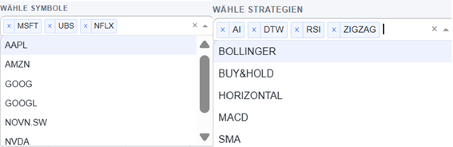

# Benutzerhandbuch – Nutzer‑Workflow
*Version: 1.0  · Donat Rüttimann

## 1) Vorbereitung
- **Strategien definieren:** Lege deine Strategiemodule in `strategies/` ab (z. B. `macd_strategy.py`, `bollinger_strategy.py`).
- **Strategie‑Beschreibungen erstellen:** Für jede Strategie eine Markdown‑Datei in `docs/strategy_descriptions/`, z. B. `MACD_description.md`.
- **Symbolliste festlegen:** Öffne `config/settings.py` und pflege `PREDEFINED_SYMBOLS`, z. B. `['AAPL', 'GOOG', 'MSFT']`.
- **Startkapital und Gebühren definieren:**  Öffne `config/settings.py` und definiere das Startkapital und die Gebühren. 

*Screenshots:*


---


## 2) Backtests ausführen
Starte `backtest_runner.py`. Der Runner iteriert über **alle Strategien** × **alle Symbole**, führt Backtests aus und speichert die Ergebnisse als `StrategieName_Symbol_returns.pkl` in `results/`. Historische Daten für alle vordefinierten Symbole werden über `data/data_handler.py` geladen und als CSVs in `data/historical_prices/` gespeichert.

**Ausführen:**
```bash

cd "eignerpfad\testdifa\Projekt\my_trading_bot"

python backtest_runner.py

```

**Ergebnis:** 

a)Pro Symbol eine .csv Datei unter `data/historical_prices/`. 

b)Pro Symbol und Strategie Kombination eine .plk Datei unter `results/`.

**Beispiele für Outputs:**
- `MACD_AAPL_returns.pkl`
- `BOLLINGER_GOOG_returns.pkl`

**Hinweis:** Wenn `results/` leer ist oder neu erzeugt werden soll, zuerst ggf. alte Dateien entfernen.

*Screenshots:*


---

## 3) Dashboard starten
Starte die Dash‑Anwendung über `dashboard/app.py`.

**Ausführen:**
```bash

cd "eignerpfad\testdifa\Projekt\my_trading_bot"

python -m dashboard.app

```
**Zugriff:** Standard‑URL im Browser `http://127.0.0.1:8050`.

*Screenshot:*


---

## 4) Interaktive Analyse im Browser

### Tab 1: „Übersicht & Vergleich“
**Zweck:** Mehrere Strategien auf mehreren Symbolen gleichzeitig vergleichen und Top‑Performer erkennen. 

**Vorgehen:** 

- **Symbol hinzufügen und Daten Laden (Optional):** Eingabefeld, um beliebige Symbole zu laden. 
- **Symbole wählen:** Mehrfachauswahl im Symbole‑Dropdown.
- **Strategien wählen:** Mehrfachauswahl im Strategien Dropdown. Insgesamt stehen 9 Strategien zur Auswahl (AI, Bollinger, Buy and Hold, DTW, HORIZONTAL, MACD, RSI, SMA, ZIGZAG)
- **Ergebnis:** Vergleichstabelle mit KPIs (z.B. CAGR, Sharpe Ratio, Profit Faktor etc.) und kumulierter Performance Chart (Equity Kurven). Ein interaktives Zoomen ist möglich im Graph


*Screenshots:*  




### Tab 2: „Strategiedetails“
**Zweck:** Eine spezifische Strategie auf einem bestimmten Symbol im Detail analysieren – inkl. QuantStats‑Metriken & Plots. 

**Vorgehen:** 
- **Strategie wählen:** Dropdown öffnen und Strategie auswählen.
- **Symbol wählen:** Das Symbol‑Dropdown aktualisiert sich abhängig von der Strategie – verfügbares Symbol wählen.
- **Ergebnis:** Detail Metriken und Tearsheet von QuantStats.
- **Hinweis:** Während der Berechnung erscheint ein Lade Spinner.


*Screenshots:*  


### Tab 3: „Strategiebeschreibungen“
**Zweck:** Beschreibungen und Implementierungsdetails jeder Strategie nachschlagen. 

**Vorgehen:**
- **Strategie wählen:** Dropdown öffnen und gewünschte Strategie auswählen.
- **Ergebnis:** Anzeige der zugehörigen Markdown‑Beschreibung (z. B. `MACD_description.md`).

*Screenshots:* 


