# Benutzerhandbuch – Nutzer‑Workflow
*Version: 1.0  · Donat Rüttimann

## 1) Vorbereitung
- **Strategien definieren:** Lege deine Strategiemodule in `strategies/` ab (z. B. `macd_strategy.py`, `bollinger_strategy.py`).
- **Symbolliste festlegen:** Öffne `config/settings.py` und pflege `PREDEFINED_SYMBOLS`, z. B. `['AAPL', 'GOOG', 'MSFT']`.
- **Strategie‑Beschreibungen erstellen:** Für jede Strategie eine Markdown‑Datei in `docs/strategy_descriptions/`, z. B. `MACD_description.md`.

*Screenshots:*
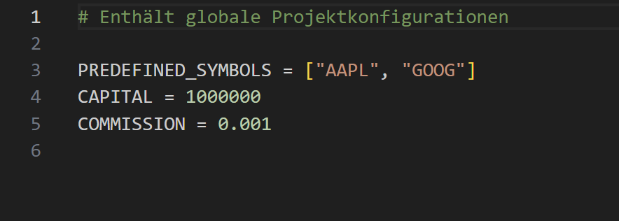
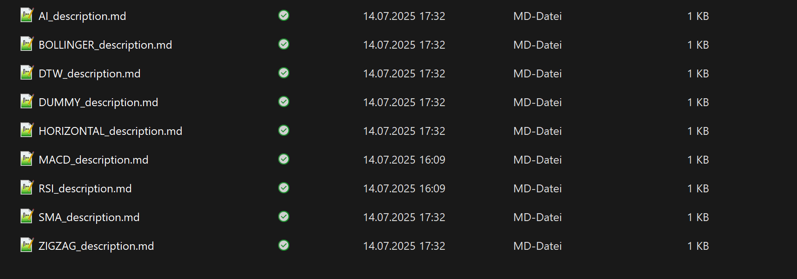

---

## 2) Datenbeschaffung
Historische Daten für alle vordefinierten Symbole werden über `data/data_handler.py` geladen und als CSVs in `data/historical_prices/` gespeichert.

**Ausführen:**
```bash
python data/data_handler.py
```
**Ergebnis:** Pro Symbol eine CSV unter `data/historical_prices/`.

*Screenshot:*
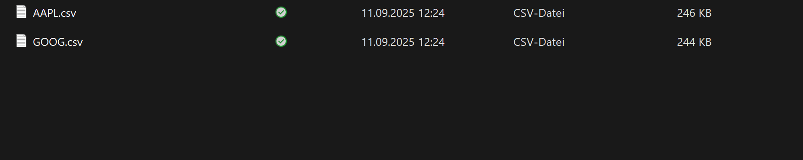

---

## 3) Backtests ausführen
Starte `backtest_runner.py`. Der Runner iteriert über **alle Strategien** × **alle Symbole**, führt Backtests aus und speichert die Ergebnisse als `StrategieName_Symbol_returns.pkl` in `results/`.

**Ausführen:**
```bash
python backtest_runner.py
```
**Beispiele für Outputs:**
- `MACD_AAPL_returns.pkl`
- `BOLLINGER_GOOG_returns.pkl`

**Hinweis:** Wenn `results/` leer ist oder neu erzeugt werden soll, zuerst ggf. alte Dateien entfernen.

*Screenshot:*
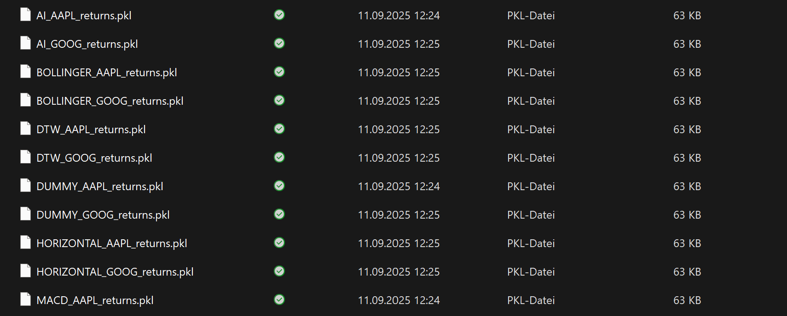

---

## 4) Dashboard starten
Starte die Dash‑Anwendung über `dashboard/app.py`.

**Ausführen:**
```bash

cd "eignerpfad\testdifa\Projekt\my_trading_bot"

.\.venv\Scripts\python.exe -m dashboard.app
```
**Zugriff:** Standard‑URL im Browser `http://127.0.0.1:8050`.

*Screenshot:*
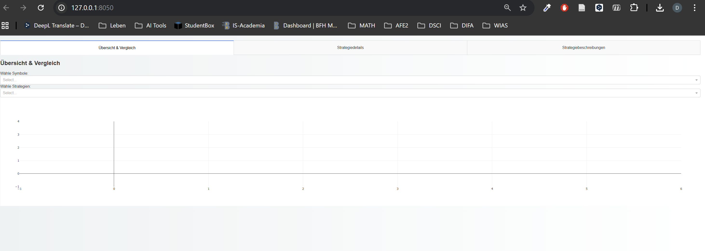

---

## 5) Interaktive Analyse im Browser

### Tab 1: „Übersicht & Vergleich“
**Zweck:** Mehrere Strategien auf mehreren Symbolen gleichzeitig vergleichen und Top‑Performer erkennen.
- **Strategien wählen:** Mehrfachauswahl im Strategien‑Dropdown.
- **Symbole wählen:** Mehrfachauswahl im Symbole‑Dropdown.
- **Ergebnis:** Vergleichstabelle mit KPIs (z. B. CAGR, Sharpe, Volatilität, Max. Drawdown) **und** kumulierter Performance‑Chart (Equity‑Kurven). Ein interaktives Zoomen ist möglich im Graph.


*Screenshots:*
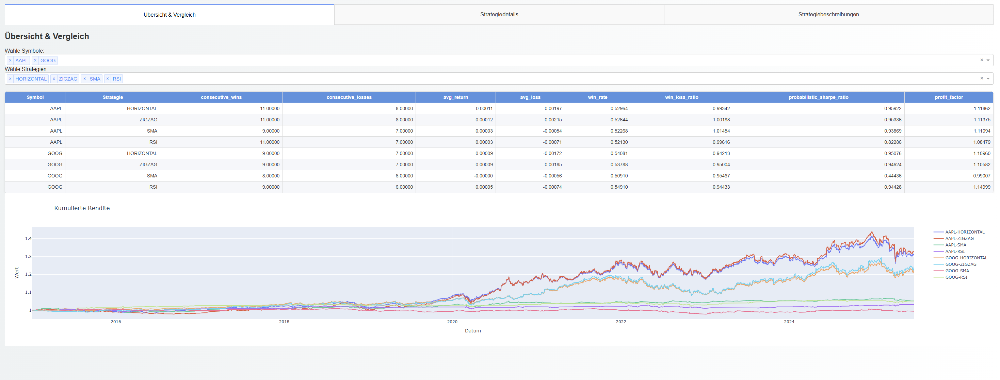
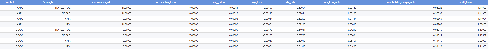
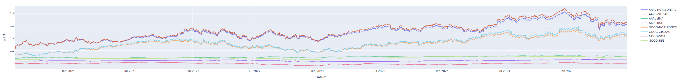

### Tab 2: „Strategiedetails“
**Zweck:** Eine spezifische Strategie auf einem bestimmten Symbol im Detail analysieren – inkl. QuantStats‑Metriken & Plots.
- **Strategie wählen:** Dropdown öffnen und Strategie auswählen.
- **Symbol wählen:** Das Symbol‑Dropdown aktualisiert sich abhängig von der Strategie – verfügbares Symbol wählen.
- **Ergebnis:** Detail‑Metriken und Plots (QuantStats). Optional: vollständiges **HTML‑Tearsheet** anzeigen lassen.


*Screenshots:*
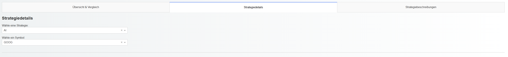
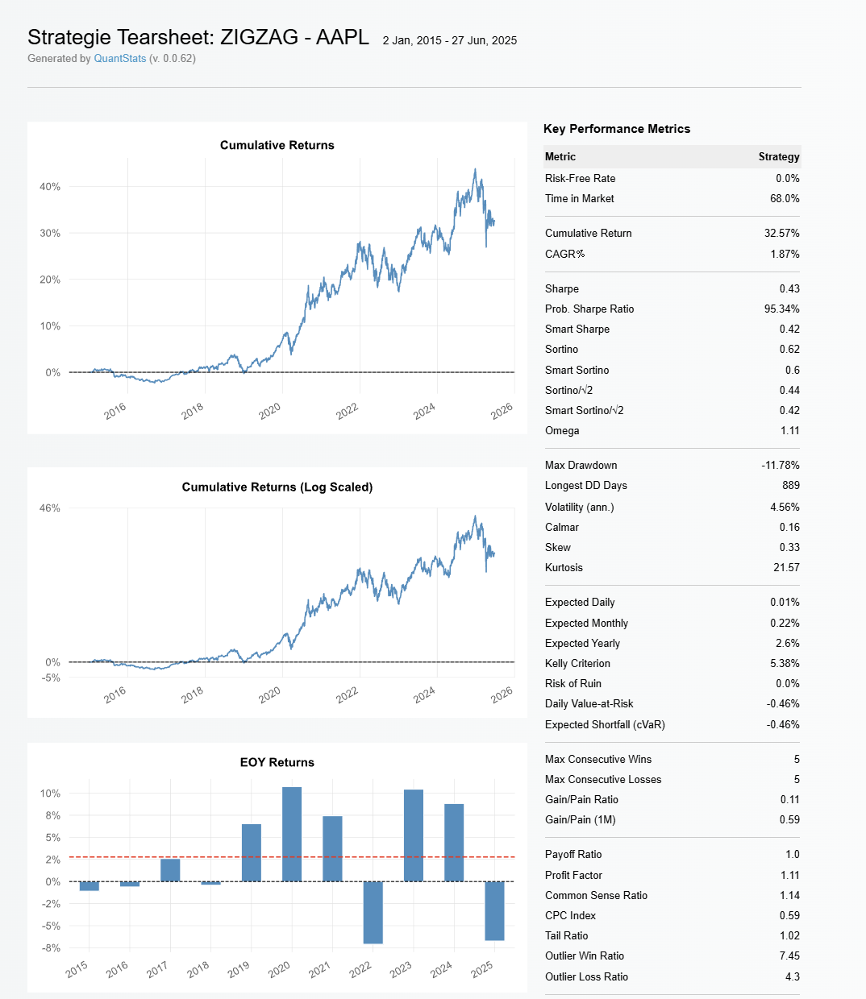

### Tab 3: „Strategiebeschreibungen“
**Zweck:** Beschreibungen und Implementierungsdetails jeder Strategie nachschlagen.
- **Strategie wählen:** Dropdown öffnen und gewünschte Strategie auswählen.
- **Ergebnis:** Anzeige der zugehörigen Markdown‑Beschreibung (z. B. `MACD_description.md`).

*Screenshots:*
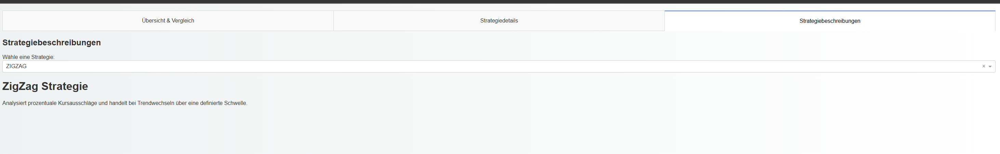
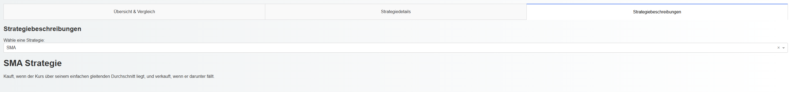
